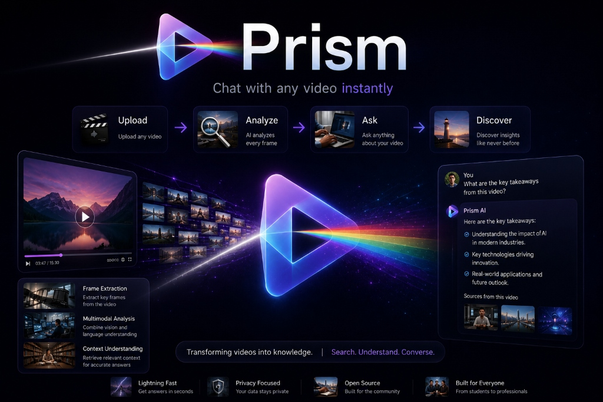

# 💎 Prism: Chat with Any Video Instantly

> **Transforming videos into knowledge. | Search. Understand. Converse.**

Prism is a state-of-the-art agentic video understanding platform built for local, high-speed multimodal search, speech recognition, and video comprehension.

## 🚀 Key Features
- ⚡ **Lightning Fast**: Sub-second multimodal similarity search powered by LanceDB and CLIP.
- 🔒 **Privacy Focused**: Operates locally with Apple Silicon Metal GPU acceleration.
- 🌐 **Open Source**: MIT licensed for developers and the open-source community.
- 🎯 **Built for Everyone**: From students and researchers to video professionals.

## 📜 License
This project is licensed under the [MIT License](LICENSE).
